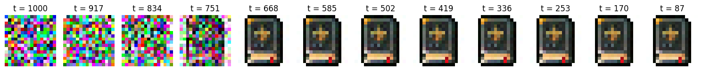
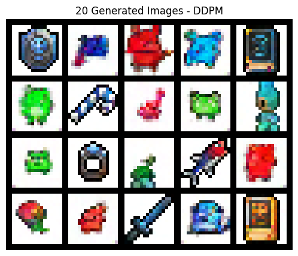
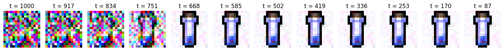
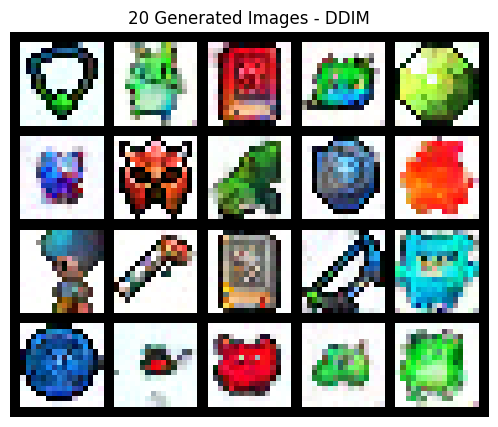
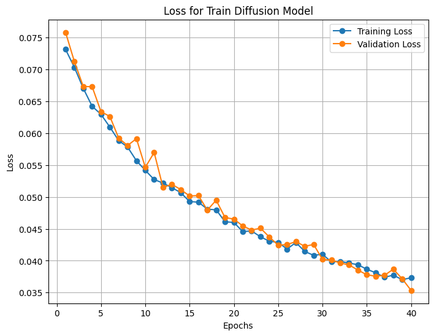

# DDPM vs. DDIM for Sprite Image Generation

This repository demonstrates how to train **Denoising Diffusion Probabilistic Models (DDPM)** and **Denoising Diffusion Implicit Models (DDIM)** to generate 16×16 sprite images. The project uses PyTorch and evaluates the generated samples via the **Fréchet Inception Distance (FID)** score.\
All experiments, training, and results are provided in the `notebooks/Diffusion_sprites.ipynb` directory.


## Project Overview
- **Goal**: Learn a probabilistic model of a **Sprites dataset** (16×16 images) and generate new samples that resemble real sprites.  
- **Approach**:  
  1. Train a **DDPM** to iteratively denoise images through a forward (noise-adding) and reverse (denoising) diffusion process.  
  2. Compare with **DDIM**, a faster sampling variant that can skip certain steps in the reverse process.  
- **Evaluation**:  
  - Use **FID score** to measure the quality of generated images.  
  - Visualize intermediate denoising steps and final samples.


## Mathematical Background

### Forward Diffusion
A forward (noising) process is defined as:
```math
q(\mathbf{x}_t \mid \mathbf{x}_0) = \mathcal{N}\Bigl(\mathbf{x}_t; \sqrt{\overline{\alpha}_t}\,\mathbf{x}_0,\,(1 - \overline{\alpha}_t)\mathbf{I}\Bigr),
```
where
$
\overline{\alpha}_t = \prod_{i=1}^{t} \alpha_i, \quad \alpha_i = 1 - \beta_i.
$
- $\beta_i$ is a variance schedule controlling how much noise is added each step.  
- $\mathbf{x}_0$ is the original (clean) image, $\mathbf{x}_t$ is the image at diffusion step $t$.

### Reverse Process (DDPM)
In **DDPM**, we learn:
```math
p_\theta(\mathbf{x}_{t-1} \mid \mathbf{x}_t),
```
by training a UNet $\epsilon_\theta(\mathbf{x}_t, t)$ to predict the noise in $\mathbf{x}_t$. The denoising step is:
```math
\mathbf{x}_{t-1} = \frac{1}{\sqrt{\alpha_t}}
\Bigl(\mathbf{x}_t - \frac{1 - \alpha_t}{\sqrt{1 - \overline{\alpha}_t}}\,\epsilon_\theta(\mathbf{x}_t, t)\Bigr) 
+ \sigma_t \mathbf{z},
```
where $\mathbf{z} \sim \mathcal{N}(0, \mathbf{I})$ and $\sigma_t$ depends on $\beta_t$.

### Reverse Process (DDIM)
**DDIM** provides a deterministic or semi-deterministic way to sample faster:
```math
\mathbf{x}_{t-1} = \sqrt{\overline{\alpha}_{t-1}}\,\mathbf{x}_0 
+ \sqrt{1 - \overline{\alpha}_{t-1}}\,\epsilon_\theta(\mathbf{x}_t, t) 
+ \sigma_t \mathbf{z},
```
where $\sigma_t$ can be smaller or zero, allowing **fewer sampling steps** without greatly reducing image quality.


## Model Architecture
We use a **UNet**-style network for noise prediction $\epsilon_\theta(\mathbf{x}_t, t)$. Key features:
1. **Skip Connections**: Preserve high-resolution details.  
2. **Residual Blocks**: Improve training stability.  
3. **Time Embedding**: Condition on the diffusion step $t$.  
4. **Context Embedding** (optional): Incorporate label or auxiliary data.


## Training Process
1. **Data**: The **Sprites dataset** (16×16 RGB images).  
2. **Forward Diffusion**: Randomly sample a timestep $t$ and generate $\mathbf{x}_t$ using the noising process.  
3. **Loss Function**: MSE between the predicted noise $\epsilon_\theta(\mathbf{x}_t, t)$ and the true noise $\mathbf{z}$.  
4. **Optimizer**: Adam with a learning rate of $1\times10^{-3}$.  
5. **Epochs**: 40 (configurable).


## Results

### DDPM Denoising
Below is an example of **DDPM** denoising from pure noise \((t=1000)\) down to a clean sprite \((t=0)\):

<p align="center">
  
</p>

### DDPM Samples
Here are **20 generated images** using DDPM:

<p align="center">
  
</p>

### DDIM Denoising
Below is the **DDIM** denoising process, showing fewer steps but still producing a clear sprite:

<p align="center">
  
</p>

### DDIM Samples
Here are **20 generated images** using DDIM:

<p align="center">
  
</p>

### Loss Curves
Below are the **training vs. validation** MSE losses over 40 epochs:

<p align="center">
  
</p>


## FID Evaluation
- **3000 images** were generated and compared to **3000 real sprites** using [pytorch-fid](https://github.com/mseitzer/pytorch-fid).
- **FID** obtained: `31.996654421590506`
A lower FID indicates higher similarity to the real dataset.

## References
- DDPM: Ho et al., Denoising Diffusion Probabilistic Models (2020)
- DDIM: Song et al., Denoising Diffusion Implicit Models (2020)
- UNet: Ronneberger et al., U-Net: Convolutional Networks for - Biomedical Image Segmentation (2015)
- FID: Heusel et al., GANs Trained by a Two Time-Scale Update Rule Converge to a Local Nash Equilibrium (2017)
